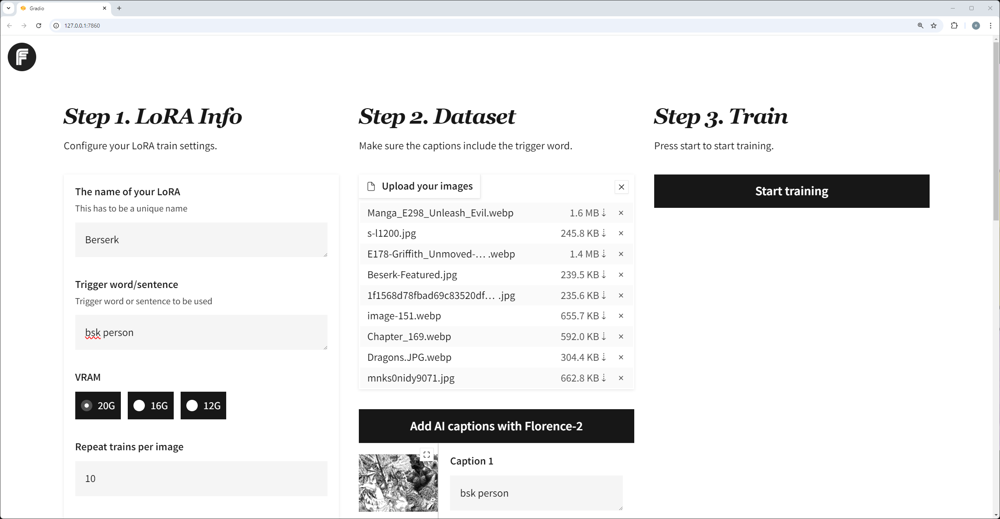
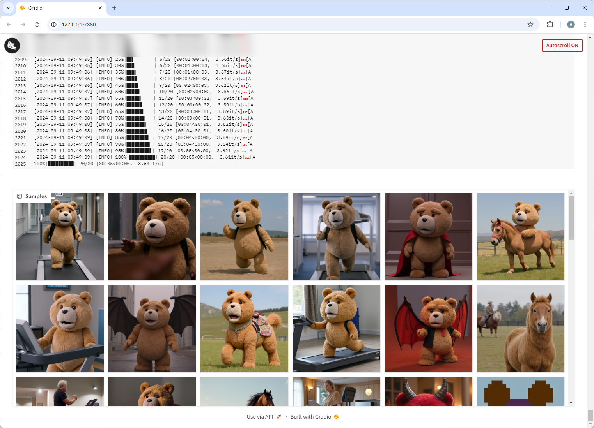
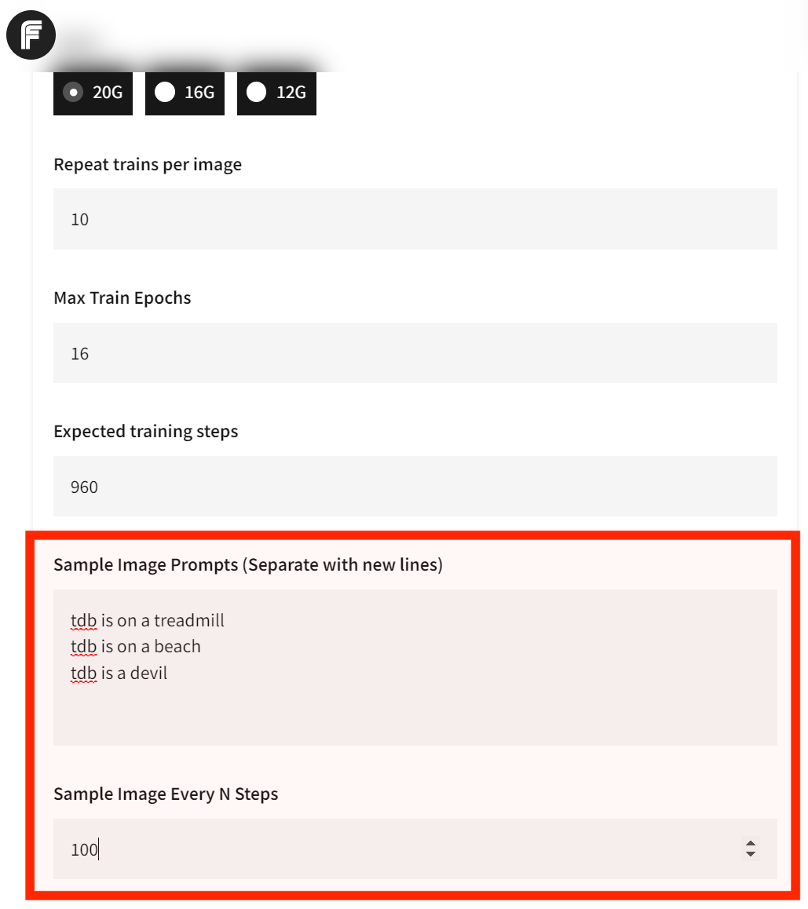
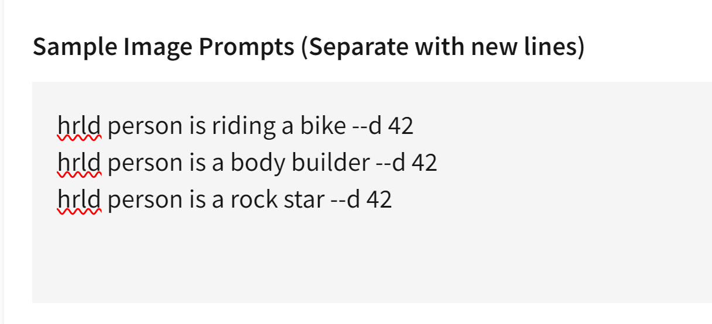
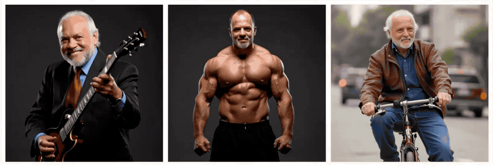
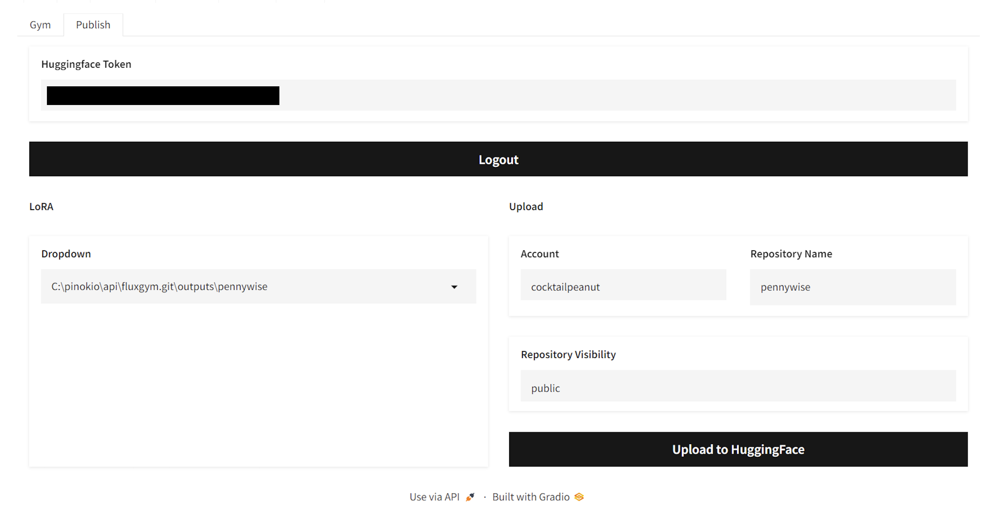
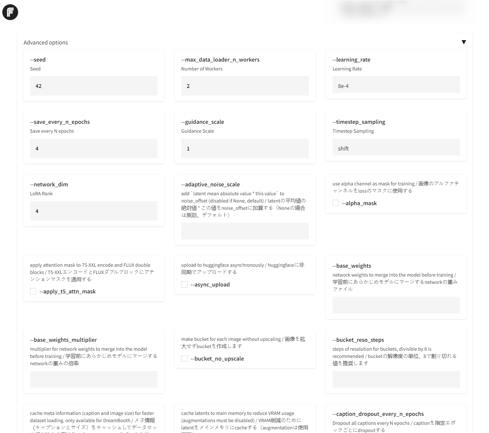

# Flux Gym

Dead simple web UI for training FLUX LoRA **with LOW VRAM (12GB/16GB/20GB) support.**

- **Frontend:** The WebUI forked from [AI-Toolkit](https://github.com/ostris/ai-toolkit) (Gradio UI created by https://x.com/multimodalart)
- **Backend:** The Training script powered by [Kohya Scripts](https://github.com/kohya-ss/sd-scripts)

FluxGym supports 100% of Kohya sd-scripts features through an [Advanced](#advanced) tab, which is hidden by default.



---


# What is this?

1. I wanted a super simple UI for training Flux LoRAs
2. The [AI-Toolkit](https://github.com/ostris/ai-toolkit) project is great, and the gradio UI contribution by [@multimodalart](https://x.com/multimodalart) is perfect, but the project only works for 24GB VRAM.
3. [Kohya Scripts](https://github.com/kohya-ss/sd-scripts) are very flexible and powerful for training FLUX, but you need to run in terminal.
4. What if you could have the simplicity of AI-Toolkit WebUI and the flexibility of Kohya Scripts?
5. Flux Gym was born. Supports 12GB, 16GB, 20GB VRAMs, and extensible since it uses Kohya Scripts underneath.

---

# News

- September 16: Added "Publish to Huggingface" + 100% Kohya sd-scripts feature support: https://x.com/cocktailpeanut/status/1835719701172756592
- September 11: Automatic Sample Image Generation + Custom Resolution: https://x.com/cocktailpeanut/status/1833881392482066638

---

# How people are using Fluxgym

Here are people using Fluxgym to locally train Lora sharing their experience:

https://pinokio.computer/item?uri=https://github.com/cocktailpeanut/fluxgym


# More Info

To learn more, check out this X thread: https://x.com/cocktailpeanut/status/1832084951115972653

# Install

## 1. One-Click Install

You can automatically install and launch everything locally with Pinokio 1-click launcher: https://pinokio.computer/item?uri=https://github.com/cocktailpeanut/fluxgym


## 2. Install Manually

First clone Fluxgym and kohya-ss/sd-scripts:

```
git clone https://github.com/cocktailpeanut/fluxgym
cd fluxgym
git clone -b sd3 https://github.com/kohya-ss/sd-scripts
```

Your folder structure will look like this:

```
/fluxgym
  app.py
  requirements.txt
  /sd-scripts
```

Now activate a venv from the root `fluxgym` folder:

If you're on Windows:

```
python -m venv env
env\Scripts\activate
```

If your're on Linux:

```
python -m venv env
source env/bin/activate
```

This will create an `env` folder right below the `fluxgym` folder:

```
/fluxgym
  app.py
  requirements.txt
  /sd-scripts
  /env
```

Now go to the `sd-scripts` folder and install dependencies to the activated environment:

```
cd sd-scripts
pip install -r requirements.txt
```

Now come back to the root folder and install the app dependencies:

```
cd ..
pip install -r requirements.txt
```

Finally, install pytorch Nightly:

```
pip install --pre torch torchvision torchaudio --index-url https://download.pytorch.org/whl/nightly/cu121
```

Now let's download the model checkpoints.

First, download the following models under the `models/clip` foder:

- https://huggingface.co/comfyanonymous/flux_text_encoders/resolve/main/clip_l.safetensors?download=true
- https://huggingface.co/comfyanonymous/flux_text_encoders/resolve/main/t5xxl_fp16.safetensors?download=true

Second, download the following model under the `models/vae` folder:

- https://huggingface.co/cocktailpeanut/xulf-dev/resolve/main/ae.sft?download=true

Finally, download the following model under the `models/unet` folder:

- https://huggingface.co/cocktailpeanut/xulf-dev/resolve/main/flux1-dev.sft?download=true

The result file structure will be something like:

```
/models
  /clip
    clip_l.safetensors
    t5xxl_fp16.safetensors
  /unet
    flux1-dev.sft
  /vae
    ae.sft
/sd-scripts
/outputs
/env
app.py
requirements.txt
...
```

## 3. Install via Docker

First clone Fluxgym and kohya-ss/sd-scripts:

```
git clone https://github.com/cocktailpeanut/fluxgym
cd fluxgym
git clone -b sd3 https://github.com/kohya-ss/sd-scripts
```

Now build the image and run it via `docker-compose`:
```
docker compose up -d --build
```

Open web browser and goto the IP address of the computer/VM: http://localhost:7860

# Start

Go back to the root `fluxgym` folder, with the venv activated, run:

```
python app.py
```

> Make sure to have the venv activated before running `python app.py`.
>
> Windows: `env/Scripts/activate`
> Linux: `source env/bin/activate`

# Usage

The usage is pretty straightforward:

1. Enter the lora info
2. Upload images and caption them (using the trigger word)
3. Click "start".

That's all!


# Configuration

## Sample Images

By default fluxgym doesn't generate any sample images during training.

You can however configure Fluxgym to automatically generate sample images for every N steps. Here's what it looks like:



To turn this on, just set the two fields:

1. **Sample Image Prompts:** These prompts will be used to automatically generate images during training. If you want multiple, separate teach prompt with new line.
2. **Sample Image Every N Steps:** If your "Expected training steps" is 960 and your "Sample Image Every N Steps" is 100, the images will be generated at step 100, 200, 300, 400, 500, 600, 700, 800, 900, for EACH prompt.



## Advanced Sample Images

Thanks to the built-in syntax from [kohya/sd-scripts](https://github.com/kohya-ss/sd-scripts?tab=readme-ov-file#sample-image-generation-during-training), you can control exactly how the sample images are generated during the training phase:

Let's say the trigger word is **hrld person.** Normally you would try sample prompts like:

```
hrld person is riding a bike
hrld person is a body builder
hrld person is a rock star
```

But for every prompt you can include **advanced flags** to fully control the image generation process. For example, the `--d` flag lets you specify the SEED.

Specifying a seed means every sample image will use that exact seed, which means you can literally see the LoRA evolve. Here's an example usage:

```
hrld person is riding a bike --d 42
hrld person is a body builder --d 42
hrld person is a rock star --d 42
```

Here's what it looks like in the UI:



And here are the results:



In addition to the `--d` flag, here are other flags you can use:


- `--n`: Negative prompt up to the next option.
- `--w`: Specifies the width of the generated image.
- `--h`: Specifies the height of the generated image.
- `--d`: Specifies the seed of the generated image.
- `--l`: Specifies the CFG scale of the generated image.
- `--s`: Specifies the number of steps in the generation.

The prompt weighting such as `( )` and `[ ]` also work. (Learn more about [Attention/Emphasis](https://github.com/AUTOMATIC1111/stable-diffusion-webui/wiki/Features#attentionemphasis))

## Publishing to Huggingface

1. Get your Huggingface Token from https://huggingface.co/settings/tokens
2. Enter the token in the "Huggingface Token" field and click "Login". This will save the token text in a local file named `HF_TOKEN` (All local and private).
3. Once you're logged in, you will be able to select a trained LoRA from the dropdown, edit the name if you want, and publish to Huggingface.




## Advanced

The advanced tab is automatically constructed by parsing the launch flags available to the latest version of [kohya sd-scripts](https://github.com/kohya-ss/sd-scripts). This means Fluxgym is a full fledged UI for using the Kohya script.

> By default the advanced tab is hidden. You can click the "advanced" accordion to expand it.




